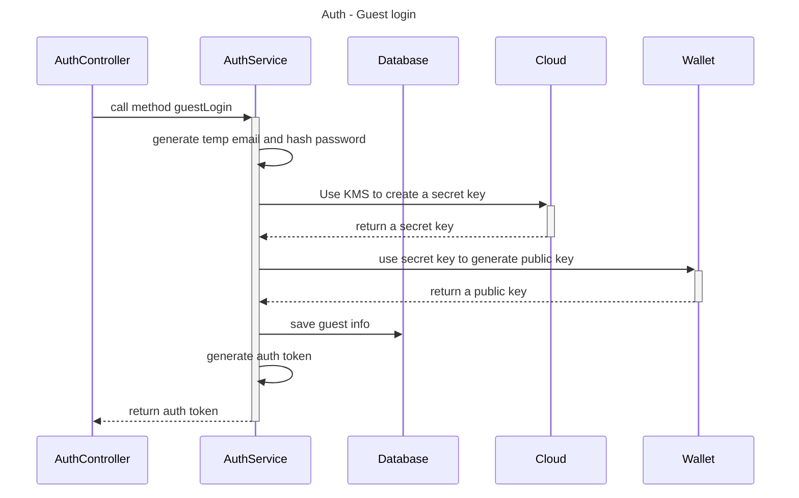

# API for guest login

API: `guest/login`

**Requirement:** the user has `not logged in`

**Description:**

`User` can login to the application using `guest account`.

```mermaid
sequenceDiagram
title Auth - Guest login
    participant AuthController
    participant AuthService
    participant Database
    participant Cloud
    participant Wallet

    AuthController ->>+ AuthService: call method guestLogin
    AuthService ->> AuthService: generate temp email and hash password
    AuthService ->>+ Cloud: Use KMS to create a secret key
    Cloud -->>- AuthService: return a secret key
    AuthService ->>+ Wallet: use secret key to generate public key
    Wallet -->>- AuthService: return a public key
    AuthService ->> Database: save guest info
    AuthService ->> AuthService: generate auth token
    AuthService -->>- AuthController: return auth token
```