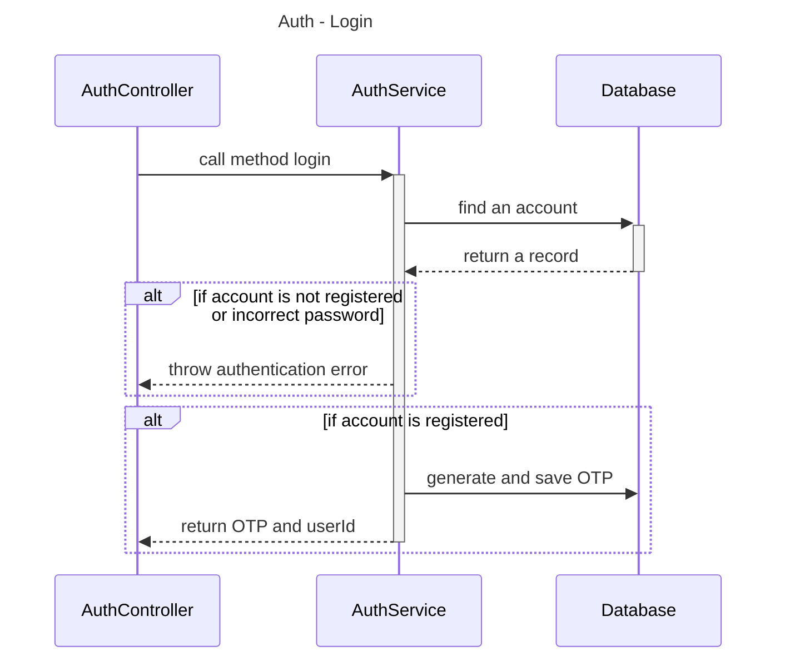

# API for login

API: `/login`

**Requirement:** the user has `not logged in`

**Description:**

`User` can login to the application.

```mermaid
sequenceDiagram
title Auth - Login
    participant AuthController
    participant AuthService
    participant Database

    AuthController ->>+ AuthService: call method login
    AuthService ->>+ Database: find an account
    Database -->>- AuthService: return a record
    alt if account is not registered or incorrect password
      AuthService -->> AuthController: throw authentication error
    end
    alt if account is registered
        AuthService ->> Database: generate and save OTP
        AuthService -->>- AuthController: return OTP and userId
    end
```
