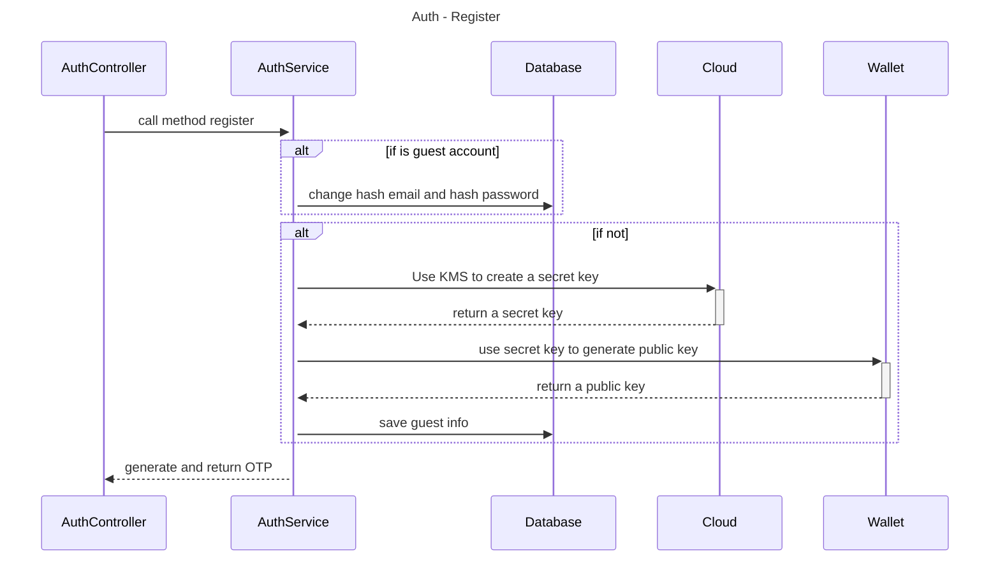

# API for register

API: `/register`

**Requirement:** the user has `not logged in`

**Description:**

`User` can register to the application.

```mermaid
sequenceDiagram
title Auth - Register
    participant AuthController
    participant AuthService
    participant Database
    participant Cloud
    participant Wallet

    AuthController ->>+ AuthService: call method register
    alt if is guest account
      AuthService ->> Database: change hash email and hash password
    end
    alt if not
        AuthService ->>+ Cloud: Use KMS to create a secret key
        Cloud -->>- AuthService: return a secret key
        AuthService ->>+ Wallet: use secret key to generate public key
        Wallet -->>- AuthService: return a public key
        AuthService ->> Database: save guest info
    end
    AuthService -->> AuthController: generate and return OTP
```
