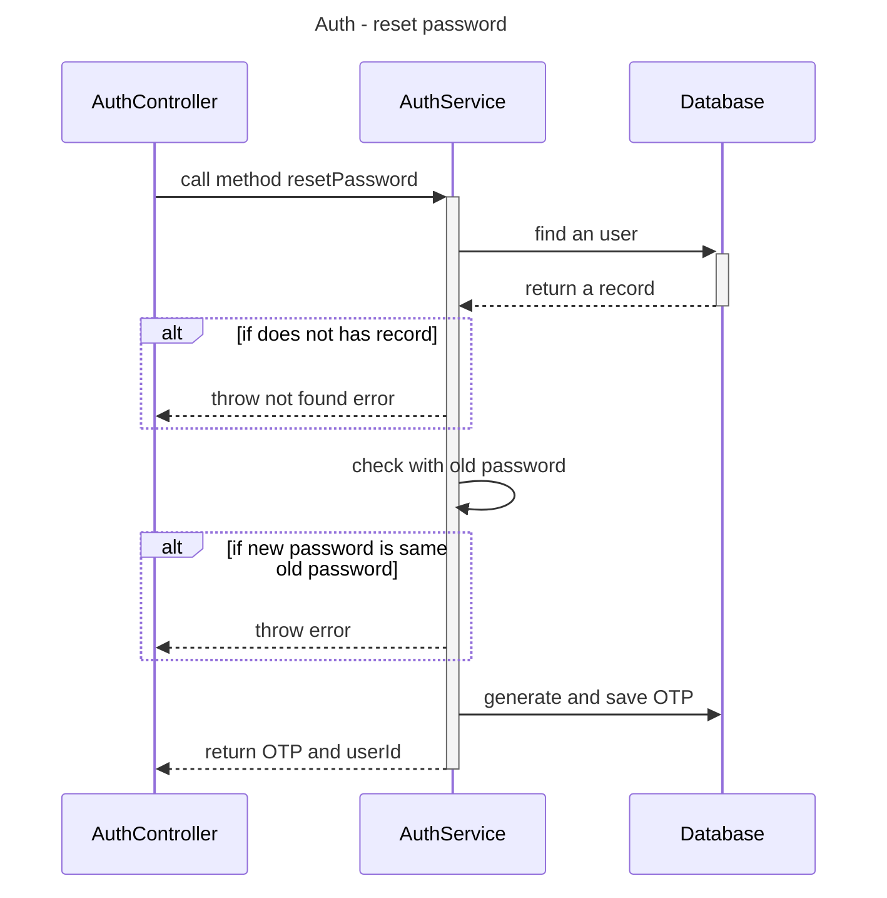

# API for reset password

API: `/reset-password`

**Requirement:** the user has `logged in` (send the `access token` in request).

**Description:**

`User` can reset password.

```mermaid
sequenceDiagram
title Auth - reset password
    participant AuthController
    participant AuthService
    participant Database

    AuthController ->>+ AuthService: call method resetPassword
    AuthService ->>+ Database: find an user
    Database -->>- AuthService: return a record
    alt if does not has record
      AuthService -->> AuthController: throw not found error
    end
    AuthService ->> AuthService: check with old password
    alt if new password is same old password
      AuthService -->> AuthController: throw error
    end
    AuthService ->> Database: generate and save OTP
    AuthService -->>- AuthController: return OTP and userId
```
