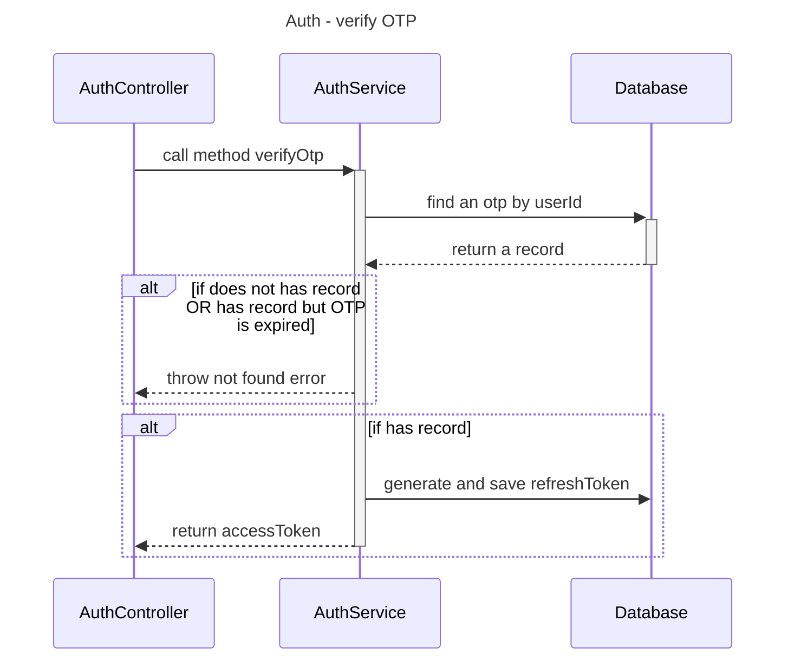

# API for verify OTP

API: `/verify-otp`

**Requirement:** the user has `logged in or registered` (send the `access token` in request).

**Description:**

`User` can verify OTP to login or reset password.

